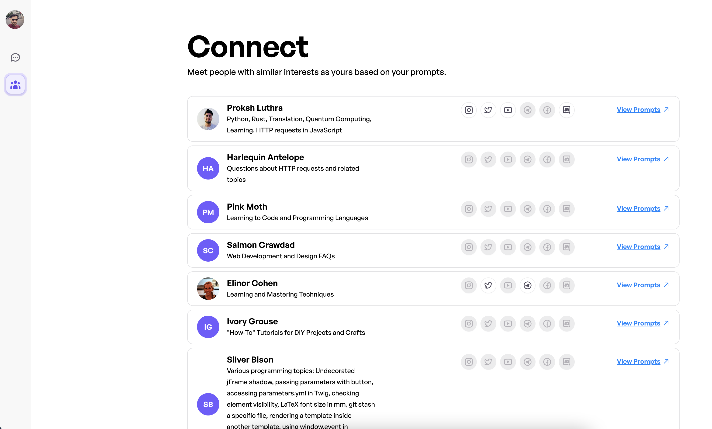

# GPTogether

GPTogether turns GPT prompts into a social experience. Connect with others who are curious about similar topics. Explore the world through the unique lens of collaborative prompting. Inspire together in the age of GPT. Forget social networks. Experience the magic of prompt networks.

It is a project that aims to improve the experience of ChatGPT by sharing prompts and connecting users based on their prompts and interests. It's a great tool for people who are looking to expand their social circles, have engaging conversations, and discover new things. The project uses Next.js for the client-side, FastAPI for the backend, and an ML module using vector DB.

## Frontend

This frontend repository is built using Next.js and Tailwind CSS, and includes a comprehensive design system. It integrates Firebase authentication for secure user authentication.

The app, called "GPTogether", provides a complete user interface for interacting with ChatGPT. The app allows users to chat with ChatGPT, receive prompt suggestions, and explore similar conversations based on their chats with ChatGPT. Additionally, users can find and connect with people who share similar interests.

Overall, this frontend repository provides an intuitive and user-friendly interface for interacting with ChatGPT, making it easy to engage with AI-powered conversations and find like-minded individuals.

[Frontend Setup Instructions](frontend/README.md)

## Backend

GPTogether backend code is written in Python which enhances the capabilities of ChatGPT, a large language model trained by OpenAI based on the GPT-3.5 architecture. It plays a critical role in handling the server-side logic, data storage, and retrieval that powers the chatbot's natural language processing and conversation management.

[Backend Setup Instructions](backend/README.md)

## NLP

[NLP Setup Instructions](nlp/README.md)

## Demo

## Future features

1. Support for extensions
    
    You all must be wondering why didn’t we have this in a form of an extension where the users would simply enable the extension. Get autosuggestions and similar users and conversation lists while interacting with ChatGPT. The answer to that is the control. Our own app gives us more control and makes it less congested on the actual interface of the ChatGPT. Slight changes to the destination app can break the extension. And similarly, problems in the extension can spoil the user’s experience with ChatGPT. Now, that we have a robust backend ready. We can build an extension to not just ChatGPT but also other apps wanting to leverage the capabilities of GPTogether.
    
2. Vector database integration to store vectors data

    Currently, we are using the Postgres database to store vectors. Postgres fundamentally is not built to store vector data. We plan to use a vector database to store the vector data which will enable faster retrieval and processing.

3. Exploration and fine-tuning of other LLMs

4. Tokenomics

    Give incentives to the creators of the most used conversations and prompts.
5. Censorship

    We all remember this incident where “Samsung Workers Accidentally Leaked Trade Secrets Via ChatGPT”. We can build in-house algorithms to prevent such incidences. Also, based on the age groups and various other parameters, we could also work on what users, prompts, and conversations are recommended to the end users.
6. In-app chat integration between the users

## License

The GPTogether project is licensed under the MIT License. See the [LICENSE file](LICENSE) for more information.

