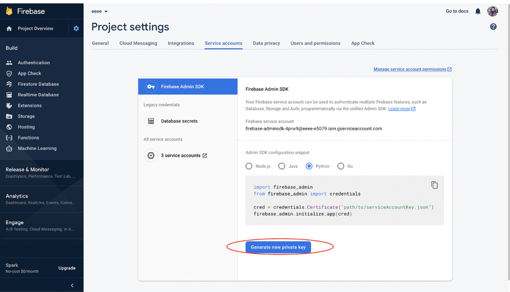

# GPTogether

This backend code written in Python enhances the capabilities of ChatGPT, a large language model trained by OpenAI based on the GPT-3.5 architecture. It plays a critical role in handling the server-side logic, data storage, and retrieval that powers the chatbot's natural language processing and conversation management.


## Getting Started

Welcome to GPTogether ! In order to get started with the project, please follow the steps outlined below. The GPTogether backend runs in conjection with frontend and a NLP service. 

### Prerequisites

Before you can start working with the project, you will need to have the following installed on your system:

- Python (version 3.8 or higher)
- pipenv (Python virtualenv management tool )
- Elasticsearch 7.10 or higher
- PostgreSQL
- Redis
- Firebase Authentication

> Create a private key from service account section within Firebase Admin SDK using "Generate new private key" option. Check the image below:

Download this JSON file and place it under `FIREBASE_KEY_PATH` path with the name `firebase-key.json` 

### Installing

To install the project, please follow the steps below:

1. Clone the repository: 

```bash
git clone https://github.com/sepana-io/gptogether-backend
```

2. Navigate to the folder:

```bash
cd gptogether-backend
```

3. Create `.env` file and set the variables in the `.env` file

```bash
# Redis credentials (for caching)
GPTOGETHER_REDIS_PASSWORD=""
GPTOGETHER_REDIS_HOST=""
GPTOGETHER_REDIS_PORT=""

# Postgres SQL database credentials (for Medata storage)
# Here RO means readonly database host. We created two, so that one could be used for readonly operations, while another for both read and write
GPTOGETHER_DATABASE_USER=""
GPTOGETHER_DATABASE_PASSWORD=""
GPTOGETHER_DATABASE_HOST_RO=""
GPTOGETHER_CONNECTION_POOL_RO=""
GPTOGETHER_DATABASE_HOST=""
GPTOGETHER_CONNECTION_POOL=""
GPTOGETHER_DATABASE_NAME=""

# Elasticsearch related credentials (for Documents and history storage and retrieval)
ES_ADMIN_API_KEY=""
ES_ADMIN_API_ID=""
CONFIG_MODE="Production"
USER_ONBOARD_TEMPLATE_ID=""
ES_INDEX_NAME="gptogether_store"

# Key which protects your secrets while persisting them to database
ENCRYPTING_KEY=""

> Can generate a new one using `python key_generator.py`

# Endpoints for auto suggest, find similar users based on ID or their prompts
AUTO_SUGGESTION_ENDPOINT=""
SIMILAR_USERS_ENDPOINT_USERID=""
SIMILAR_USERS_ENDPOINT_PROMPTS=""
```

4. Activate the pipenv shell

```sh
pipenv shell
```

5. Install the dependencies

```bash
pipenv install
```

6. Run the setup locally

```bash
python run_locall.py
```

The backend is accessible over http://localhost:8000
